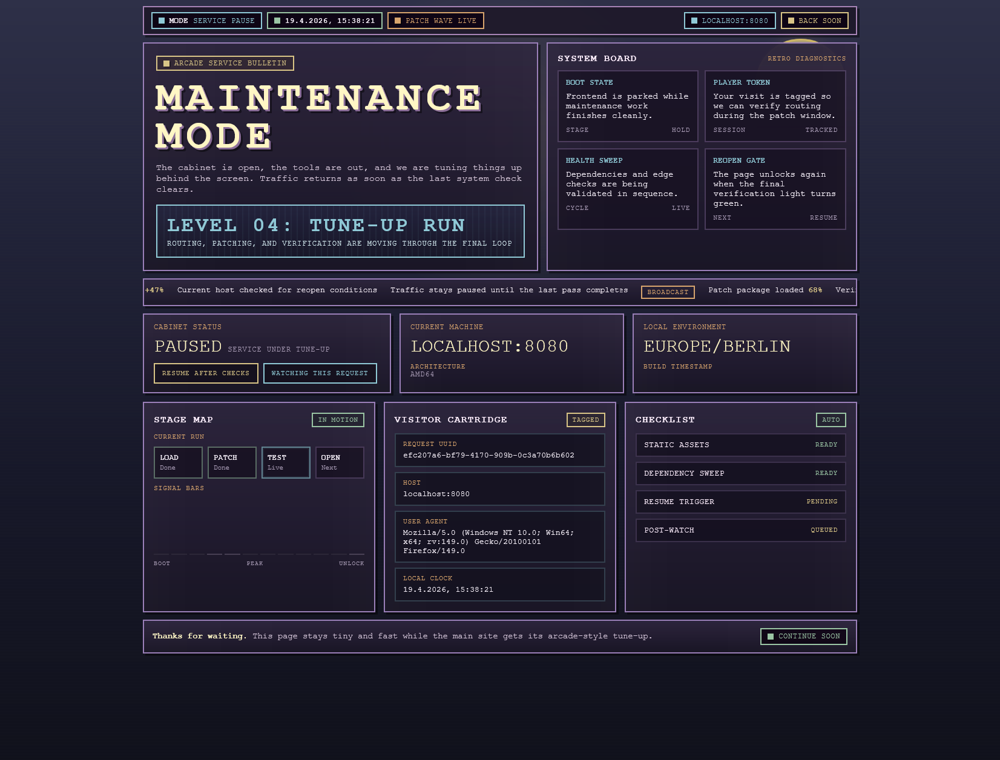

# easy-maintenance

<https://github.com/crashlooping/easy-maintenance>

A small application to provide a http endpoint for maintenance tasks. Created using ChatGPT and Go 1.21.

## Screenshot



## Build and run

```bash
# Windows
go build -o easy-maintenance-app.exe

# Linux
CGO_ENABLED=0 go build -ldflags="-X main.BuildTimestamp=$(date -u +'%Y-%m-%dT%H:%M:%SZ')" -o easy-maintenance-app .

# Docker
docker build -t easy-maintenance-app .
docker run --rm -p 8080:8080 easy-maintenance-app
```

## ghcr.io

```bash
docker pull ghcr.io/crashlooping/easy-maintenance/easy-maintenance:latest
docker run --rm -p 8080:8080 ghcr.io/crashlooping/easy-maintenance/easy-maintenance:latest
```

## Go

```bash
go get -u
go mod tidy
```

## Development

### Hot Reloading with Air

For faster development iteration, use [Air](https://github.com/air-verse/air) to automatically rebuild and restart your application when files change.

**Install Air:**

```bash
go install github.com/air-verse/air@latest
```

**Run with Air:**

```bash
air
```

This will watch for file changes and automatically rebuild the application. The server will restart and be available at `http://localhost:8080`.

Air reads its configuration from `.air.toml` if it exists in your project root. For the default behavior with this project, just run `air` with no configuration file needed.
